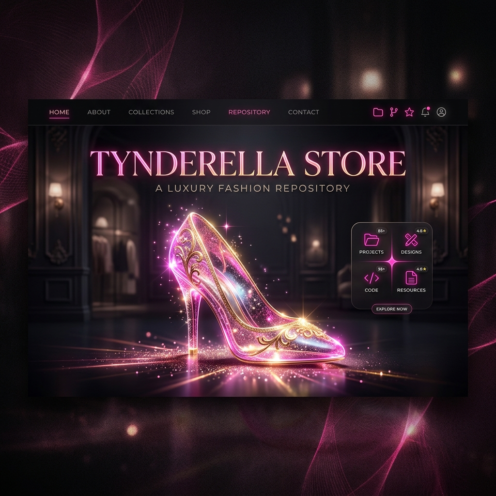

# 👑 Tynderella Store — Smoke Like a Princess

Welcome to **Tynderella Store**, a luxury, modern e-commerce landing page designed with premium dark aesthetics, elegant typography, and stunning interactive animations.



## ✨ Features

- **Luxury Visual Design:** Vibrant pink and gold accents contrasted against a deep zinc-950 backdrop.
- **Glassmorphism & Micro-animations:** Responsive sticky navigation bar with real-time backdrop blur filtering and interactive hover states.
- **Dynamic Starfall Canvas:** Interactive HTML5 Canvas animation simulating falling stars and shooting meteors in pink and gold hues.
- **Manifesto Scroll Reveal:** Custom word-by-word reveal effect triggered by the viewport scroll depth.
- **Product Catalogues:** Clean, modern grids showcasing exclusive curated product cards with scroll-fade-in effect.
- **Responsive Layout:** Pixel-perfect design optimized for mobile, tablet, and ultra-wide screens.

## 🛠️ Technology Stack

- **HTML5 & Semantic Structure:** Built for high accessibility, modern SEO practices, and speed.
- **Vanilla CSS3:** Bespoke styling system using native CSS variables for colors, typography, and responsive media queries. No external bloated frameworks.
- **Modern Web Fonts:** Powered by Google Fonts (Outfit, Playfair Display, Great Vibes, Allura).
- **Interactive JavaScript:** Custom performance-optimized viewport calculations and canvas animations (automatically adjusted for users with `prefers-reduced-motion`).

## 🚀 Getting Started

Simply open `index.html` in your favorite web browser or host the repository files directly using any static web server (such as GitHub Pages, Vercel, Netlify, or Apache).

### Local Server Setup (Optional)
If you want to run the project using Node.js:
```bash
# Start a simple HTTP server (requires Node.js)
npx http-server .
```

## 📁 Repository Structure

```
├── assets/                  # High-quality visual assets and logos
│   ├── logo-transparent.png
│   ├── logo-sapatinho-transparent.png
│   ├── heel-glass.png
│   └── github-cover.png     # Repository banner image
├── uploads/                 # Product and media uploads
├── screenshots/             # Design reference screenshots
├── index.html               # Main entrypoint
├── README.md                # Project documentation
└── Tynderella Store.html    # Design prototype backup
```

## 🩷 License
Tynderella Store is created for retail fashion/accessory concepts (+18). All rights reserved.
